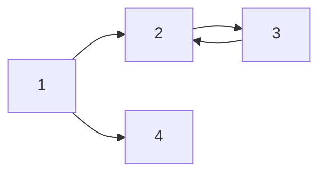

_italic_  
**bold**  
**_italic+bold_**  
~~hello~~  

* list1  
* list2  
  - A  
    - B

1. list 1
2. list 2
3. list 3
   1. A
      1. B

| 제목  | description | 비고  |
| --- | ----------- | --- |
| hello  | 1           | 2   |
| bonjour | 3           | 4   |

`simple highlighter`  


$a^2 + b^2 = c^2$  

$$(\alpha + \beta)^2 = \alpha^2 + 2 \alpha \beta + \beta^2$$  

[tex wiki](https://ko.wikipedia.org/wiki/%EC%9C%84%ED%82%A4%EB%B0%B1%EA%B3%BC:TeX_%EB%AC%B8%EB%B2%95)  
[tex wiki_eng](https://en.wikipedia.org/wiki/TeX)




---


### Code snippets
Jekyll also offers powerful support for code snippets:

```ruby
def print_hi(name)
  puts "Hi, #{name}"
end
print_hi('Tom')
#=> prints 'Hi, Tom' to STDOUT.
``` 
** code image : https://carbon.now.sh/ 

---
### Quote  

> Only one thing is impossible for God: To find any sense in any copyright law on the planet.
  
> <cite><a href="http://www.brainyquote.com/quotes/quotes/m/marktwain163473.html">Mark Twain</a></cite>
---
### link
Check out the [Jekyll docs][jekyll-docs] for more info on how to get the most out of Jekyll. File all bugs/feature requests at [Jekyll’s GitHub repo][jekyll-gh]. If you have questions, you can ask them on [Jekyll Talk][jekyll-talk].

[jekyll-docs]: https://jekyllrb.com/docs/home
[jekyll-gh]:   https://github.com/jekyll/jekyll
[jekyll-talk]: https://talk.jekyllrb.com/  
---
### Notice
A notice displays information that explains nearby content. Often used to call attention to a particular detail.

When using Kramdown `{: .notice}` can be added after a sentence to assign the `.notice` to the `<p></p>` element. 

**Changes in Service:** We just updated our [privacy policy](#) here to better service our customers. We recommend reviewing the changes.
{: .notice}

**Primary Notice:** Lorem ipsum dolor sit amet, consectetur adipiscing elit. Integer nec odio. [Praesent libero](#). Sed cursus ante dapibus diam. Sed nisi. Nulla quis sem at nibh elementum imperdiet.
{: .notice--primary}

**Info Notice:** Lorem ipsum dolor sit amet, [consectetur adipiscing elit](#). Integer nec odio. Praesent libero. Sed cursus ante dapibus diam. Sed nisi. Nulla quis sem at nibh elementum imperdiet.
{: .notice--info}

**Warning Notice:** Lorem ipsum dolor sit amet, consectetur adipiscing elit. [Integer nec odio](#). Praesent libero. Sed cursus ante dapibus diam. Sed nisi. Nulla quis sem at nibh elementum imperdiet.
{: .notice--warning}

**Danger Notice:** Lorem ipsum dolor sit amet, [consectetur adipiscing](#) elit. Integer nec odio. Praesent libero. Sed cursus ante dapibus diam. Sed nisi. Nulla quis sem at nibh elementum imperdiet.
{: .notice--danger}

**Success Notice:** Lorem ipsum dolor sit amet, consectetur adipiscing elit. Integer nec odio. Praesent libero. Sed cursus ante dapibus diam. Sed nisi. Nulla quis sem at [nibh elementum](#) imperdiet.
{: .notice--success}

Want to wrap several paragraphs or other elements in a notice? Using Liquid to capture the content and then filter it with `markdownify` is a good way to go.

```html

#### New Site Features

* You can now have cover images on blog pages
* Drafts will now auto-save while writing


<div class="notice">{{ notice-2 | markdownify }}</div>
```


#### New Site Features

* You can now have cover images on blog pages
* Drafts will now auto-save while writing


<div class="notice">
  {{ notice-2 | markdownify }}
</div>

Or you could skip the capture and stick with straight HTML.

```html
<div class="notice">
  <h4>Message</h4>
  <p>A basic message.</p>
</div>
```

<div class="notice">
  <h4>Message</h4>
  <p>A basic message.</p>
</div>  

---
### Markdown
Mrs. Darling first heard of Peter when she was tidying up her children's minds. It is the nightly custom of every good mother after her children are asleep to rummage in their minds and put things straight for next morning, repacking into their proper places the many articles that have wandered during the day.

<!--more-->

This post has a manual excerpt `<!--more-->` set after the second paragraph. The following YAML Front Matter has also be applied:

```yaml
excerpt_separator: "<!--more-->"
```
